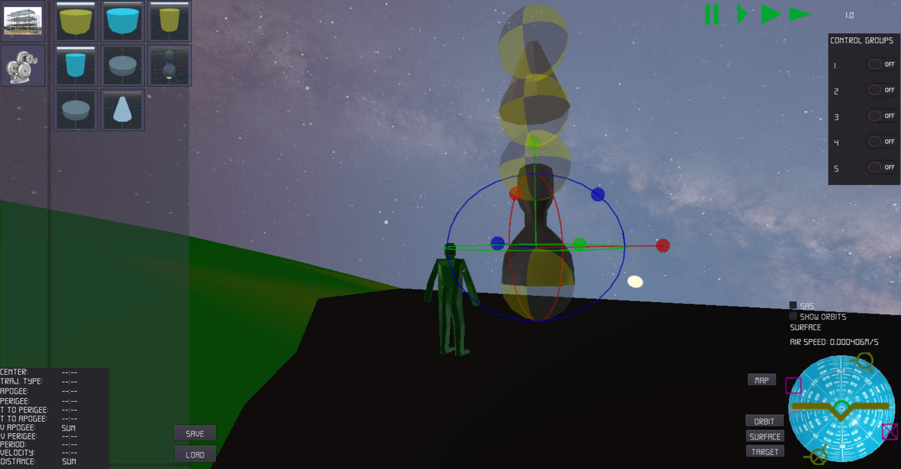
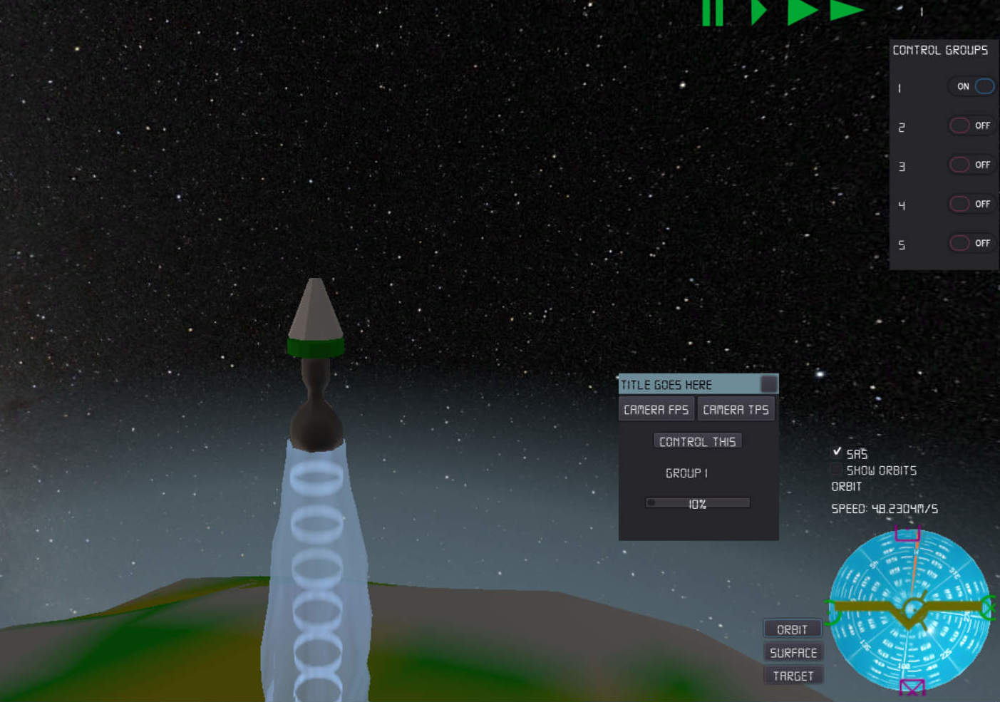
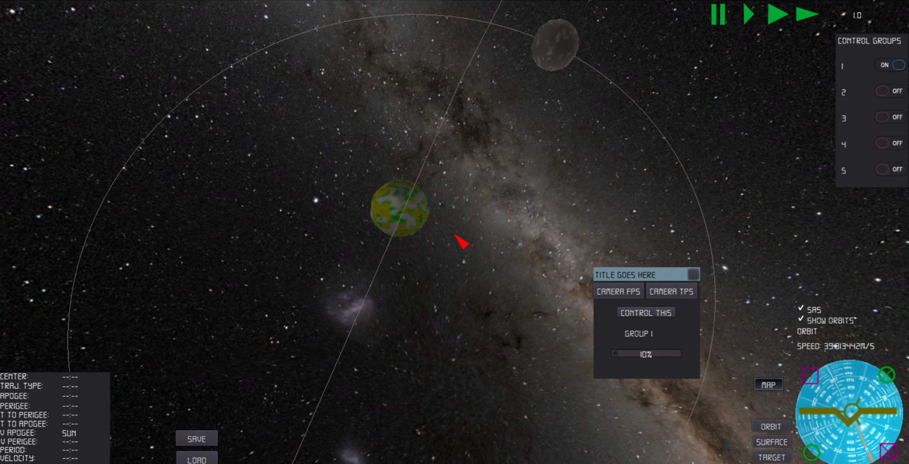
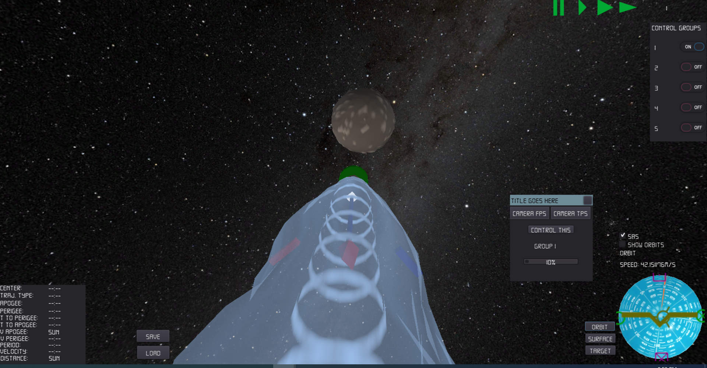
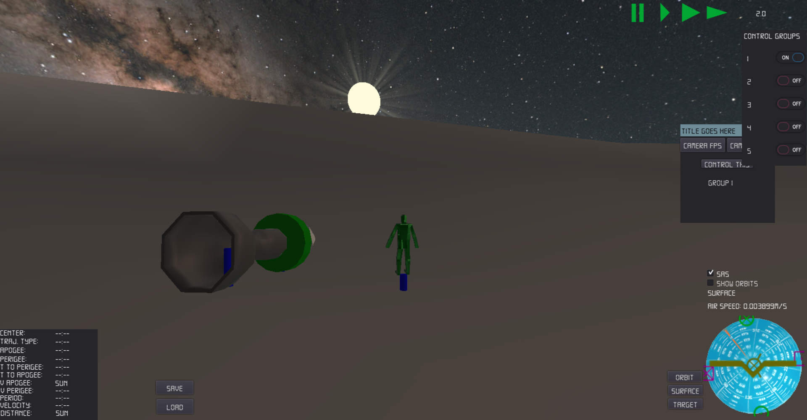

# Ignition

A game development inspired by Kerbal Space Program (KSP). Making something is more interesting than just playing a ready to use one, right?

**The game is still under heavy development!** 

Updates are posted at [Itch.io](https://litedictteam.itch.io/ignition) site.

## Features

1. One can build rockets of parts and fly to space.
2. Orbits are idealized Kepler orbits. 
3. Physical interaction is computed sumultaneously in all places where rocker parts or players are. No parts disappear if too far from the current vehicle controlled. 

## A few boring insight details

1. The game is being developed using Godot game engine.
2. A few binary modules are designed to allow rendering of very far and vary large objects like planets.
3. So far there are only a few rocket parts available for construction. And the astronaut 3d model is a very coarse one. I spent not more than 15 minutes on it... 
4. Main development focus at the moment is on implementing the 

## Screenshots

## ToDo list.
[ToDo list](docs/todo.md)

